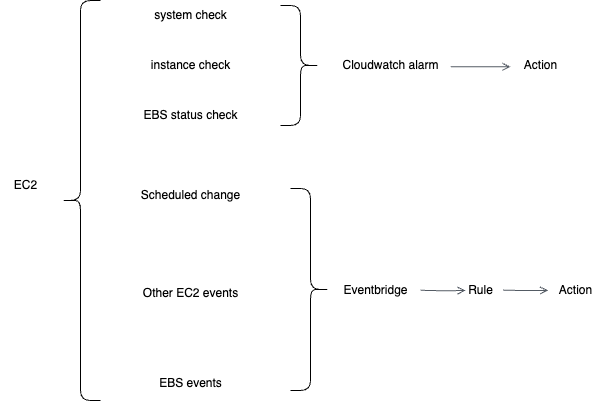

# AWS main services event monitoring

## EC2/EBS

[Best Practices](https://docs.aws.amazon.com/AWSEC2/latest/UserGuide/monitoring_best_practices.html)

### Wrokflow

[Scheduled Events](https://repost.aws/knowledge-center/eventbridge-notification-scheduled-events)

[Other EC2 Events](https://docs.aws.amazon.com/AWSEC2/latest/UserGuide/automating_with_eventbridge.html)

[EBS events](https://docs.aws.amazon.com/ebs/latest/userguide/ebs-cloud-watch-events.html)

### Event related to availability

| event type category | event ID |
| :--- | :--- |
|scheduledChange    |*         |

## RDS

[RDS Monitoring](https://docs.aws.amazon.com/AmazonRDS/latest/UserGuide/CHAP_Monitor_Logs_Events.html)

[RDS events](https://docs.aws.amazon.com/AmazonRDS/latest/UserGuide/rds-cloudwatch-events.sample.html)

### Workflow
RDS -> Eventbridge -> rule -> action

Or

RDS -> event notification -> sns -> action

### Event realted to availability

| detail-type               | EventCategory    | EventID   |
| :--- | :--- | :--- |
| RDS DB Cluster Event      | *                | *         |
| RDS DB Instance Event     | *                | *         | 
| RDS DB Parameter Group Event     | *         | *         | 
| RDS DB Security Group Event      | *         | *         | 
| RDS DB Snapshot Event     | *                | *         |
| RDS DB Cluster Snapshot Event     | *        | *         |
| RDS DB Proxy Event     | *          | *      | *
| RDS Blue Green Deployment Event     | *      | *         |
| RDS DB Instance Event     | maintenance      | *         |

## Elasticache Redis

## MemoryDB

## Amazon OpenSearch Service

## Kafka